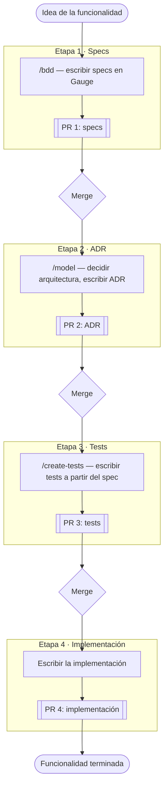

*[Read in English](./CONTRIBUTING.md)*

# Contributing

## Setup

1. `pnpm install` (instala las dependencias de todos los paquetes del
   workspace)

## Flujo de trabajo de una funcionalidad

Una funcionalidad nueva pasa por 4 etapas secuenciales, cada una mergeada
antes de arrancar la siguiente. Cada etapa tiene su propio PR, y cada PR
usa como base la rama de la etapa anterior — no `main` — para que la
revisión pueda avanzar en paralelo en vez de bloquearse esperando un merge
completo a main entre etapas ([stacked PRs](https://github.github.com/gh-stack/)
de GitHub: `gh pr create --base <rama-de-la-etapa-anterior>` en vez de
`--base main`; al mergear una etapa, GitHub retarget automáticamente su PR
hijo hacia `main`).

1. **Specs** — usa el skill `/bdd` (`.claude/skills/bdd/SKILL.md`) para
   convertir una User Story en criterios de aceptación en formato Gauge,
   guardados en `packages/<paquete>/specs/`. El skill te entrevista para
   completar los huecos que la User Story dejó implícitos (input vacío,
   casos de error). El PR 1 solo agrega o edita el archivo `.spec`.

2. **ADR** — usa el skill `/model` (`.claude/skills/model/SKILL.md`) sobre
   el spec ya mergeado para decidir la arquitectura: qué patrón de diseño
   (si aplica alguno), qué es volátil vs. estable, y si conviene organizar
   por dominio o por feature — apoyándose en la lógica de descomposición
   por volatilidad de *Righting Software* (Juval Löwy) en vez de solo
   intuición. Guarda la decisión en `packages/<paquete>/adr/`. El PR 2 usa
   como base la rama del PR 1.

3. **Tests** — usa el skill `/create-tests`
   (`.claude/skills/create-tests/SKILL.md`) para escribir tests a partir de
   los criterios de aceptación del spec, antes de que exista ninguna
   implementación. Nota: los ejemplos de ese skill apuntan a componentes de
   UI (Storybook + Playwright + Testing Library) — este monorepo no tiene
   Storybook, así que en la práctica lo que aplica acá es Vitest, y los
   tests deben verificar el comportamiento observable del spec, no
   detalles de implementación. El PR 3 usa como base la rama del PR 2.

4. **Implementación** — escribe el código que hace pasar los tests del PR
   3. El PR 4 usa como base la rama del PR 3, y es el que finalmente se
   mergea a `main`.

## Tests

- `pnpm test` corre los tests unitarios de todos los paquetes.
- `pnpm --filter @figtools/core test` corre solo los tests unitarios de ese
  paquete.
- `pnpm test:e2e` — **todavía en desarrollo.** Estos tests manejan un
  browser real de Playwright contra figma.com y todavía falta una forma
  estable de configurar contra qué archivos/nodos de Figma corren — el
  mecanismo de fixtures actual está en revisión y es probable que cambie.
  Todavía no confíes en él.
- `pnpm typecheck` corre `tsc --noEmit` en todos los paquetes.
- `pnpm build` compila todos los paquetes (Rslib) a `packages/*/dist/`.

## Estructura del monorepo

Cada paquete publicable vive en `packages/<nombre>/`, con su propio
`package.json`, `tsconfig.json` (que extiende `tsconfig.base.json` de la
raíz) y `vitest.config.ts`. Los ADRs y specs de cada paquete viven junto a
su código (`packages/<nombre>/adr/`, `packages/<nombre>/specs/`), no en la
raíz — documentan decisiones específicas de ese paquete.
