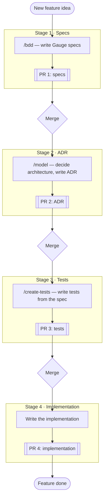

*[Leer en español](./CONTRIBUTING.es.md)*

# Contributing

## Setup

1. `pnpm install` (installs dependencies for every package in the workspace)

## Feature workflow

A new feature goes through 4 sequential stages, each one merged before the
next starts. Each stage has its own PR, and each PR is based on the
previous stage's branch — not on `main` — so review can happen in
parallel instead of blocking on a full merge-to-main between stages
(GitHub's [stacked PRs](https://github.github.com/gh-stack/):
`gh pr create --base <previous-stage-branch>` instead of `--base main`;
once a stage merges, GitHub retargets its child PR onto `main`
automatically).

1. **Specs** — use the `/bdd` skill (`.claude/skills/bdd/SKILL.md`) to turn
   a User Story into Gauge acceptance criteria, saved under
   `packages/<package>/specs/`. The skill interviews you to fill in gaps
   the User Story left implicit (empty input, error cases). PR 1 only adds
   or edits the `.spec` file.

2. **ADR** — use the `/model` skill (`.claude/skills/model/SKILL.md`) on
   the merged spec to decide the architecture: which design pattern (if
   any) fits, what's volatile vs. stable, and whether to organize by
   domain or by feature — leaning on the volatility-based decomposition
   from *Righting Software* (Juval Löwy) rather than intuition alone. Saves
   the decision under `packages/<package>/adr/`. PR 2 is based on PR 1's
   branch.

3. **Tests** — use the `/create-tests` skill
   (`.claude/skills/create-tests/SKILL.md`) to write tests from the spec's
   acceptance criteria, before any implementation exists. Note: that
   skill's examples target UI components (Storybook + Playwright +
   Testing Library) — this monorepo has no Storybook, so in practice what
   applies here is Vitest, and the tests should assert the spec's
   observable behavior, not implementation details. PR 3 is based on PR
   2's branch.

4. **Implementation** — write the code that makes PR 3's tests pass. PR 4
   is based on PR 3's branch, and is the one that finally merges into
   `main`.

## Tests

- `pnpm test` runs the unit tests for every package.
- `pnpm --filter @figtools/core test` runs only that package's unit tests.
- `pnpm test:e2e` — **still work in progress.** These tests drive a real
  Playwright browser against figma.com, and there's still no stable way to
  configure which Figma files/nodes they run against — the current fixture
  mechanism is under revision and likely to change. Don't rely on it yet.
- `pnpm typecheck` runs `tsc --noEmit` on every package.
- `pnpm build` builds every package (Rslib) into `packages/*/dist/`.

## Monorepo structure

Each publishable package lives in `packages/<name>/`, with its own
`package.json`, `tsconfig.json` (extending the root's `tsconfig.base.json`)
and `vitest.config.ts`. Each package's ADRs and specs live next to its code
(`packages/<name>/adr/`, `packages/<name>/specs/`), not at the root — they
document decisions specific to that package.
