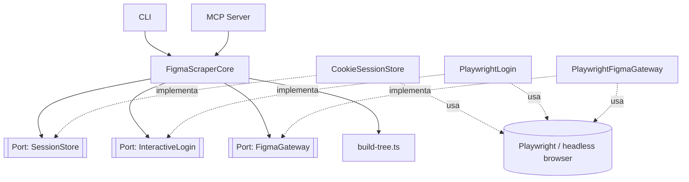

# ADR-figma-scraper-core

## Contexto

Se necesita un core que obtenga información de Figma (nodos y archivos completos)
sin depender de los rate limits de la REST API / MCP server de Figma en cuentas
free. El core debe estar desacoplado de cómo se obtienen los datos (scraping vía
headless browser, hoy con Playwright) y de la interfaz que lo consume (hoy un CLI
y un MCP server). Los criterios de aceptación de este comportamiento ya están
definidos en [`specs/gestionar_sesion_figma.spec`](../specs/gestionar_sesion_figma.spec)
y [`specs/obtener_informacion_figma.spec`](../specs/obtener_informacion_figma.spec).

## Decisión

- **Stack:** TypeScript/Node.

- **Patrón — desacople del mecanismo de scraping y sesión:** Ports & Adapters.
  El core define tres puertos (`SessionStore`, `InteractiveLogin`,
  `FigmaGateway`) y nunca importa un adapter directamente; las
  implementaciones concretas (`CookieSessionStore`, `PlaywrightLogin`,
  `PlaywrightFigmaGateway`) se inyectan vía `createFigmaScraperCore(deps)`.
  Consecuencia directa de la restricción ya acordada en `/bdd`: el core no
  debe conocer Playwright ni ningún detalle de cómo se scrapea.

- **Patrón — parseo de URL y construcción del árbol con dedup:** ninguno GoF.
  Decidir si una URL apunta a un nodo o a un file completo es un branch simple
  (presencia/ausencia de `node-id`). La deduplicación de nodos compartidos se
  resuelve con un `Map<id, FigmaNode>` mientras se recorre el árbol: no hay
  variantes intercambiables que justifiquen Strategy, Factory o Builder.

- **Modelo de errores:** `Result<T, E>` explícito (sin `throw`). Las funciones
  del core que pueden fallar devuelven `{ ok: true, value }` o
  `{ ok: false, error }`, donde `error` trae un código constante (string) y un
  mensaje legible. Se prefirió sobre excepciones nativas para forzar a CLI/MCP a
  manejar el error en el tipo de retorno en vez de depender de `try/catch`.

- **Volatilidad:**
  - **Volátil:** el mecanismo de scraping y de sesión (Playwright hoy; podría
    cambiar si Figma habilita la REST API sin rate limits, o si se cambia de
    herramienta de scraping). Vive en la capa de adapters, fuera del core.
  - **Estable:** el contrato de datos (forma del árbol de nodos, reglas de
    deduplicación de nodos compartidos, reglas de validación de URL). Vive en
    el core y no depende de cómo se obtienen los datos.

- **Organización — dominio vs. feature:** por dominio. Un único módulo `figma`
  agrupa sesión + obtención de información, porque comparten el mismo dominio y
  hoy solo hay un consumidor real (CLI y MCP, ambos wrappers finos sobre el
  mismo core). No se fragmenta por feature.

- **Gateway devuelve datos crudos, no el árbol final:** `FigmaGateway` expone
  `RawFigmaNode`/`RawFigmaFile` (sin resolver nodos compartidos); `build-tree.ts`
  es quien los convierte en `FigmaNode`/`FigmaFileResult` ya deduplicados. Sin
  esta separación, el adapter de scraping (volátil) terminaría haciendo el
  trabajo de deduplicación, que ya se había decidido como responsabilidad
  estable del core. Ver sección de interfaces.

- **Relaciones:**
  - `DERIVES_FROM` [`specs/gestionar_sesion_figma.spec`](../specs/gestionar_sesion_figma.spec)
  - `DERIVES_FROM` [`specs/obtener_informacion_figma.spec`](../specs/obtener_informacion_figma.spec)

## Estructura de carpetas propuesta

```
src/
  figma/                        # dominio, estable
    core.ts                     # FigmaScraperCore: orquesta validar → parsear → sesión → gateway → armar árbol
    ports.ts                    # SessionStore, InteractiveLogin, FigmaGateway
    model.ts                    # FigmaNode, FigmaPage, FigmaFileResult, estilos
    errors.ts                   # Result<T,E>, FigmaScraperError, códigos
    build-tree.ts               # resolveNode/resolveFile: Raw* → forma final deduplicada
  adapters/
    playwright/                 # volátil, aislado del core
      playwright-gateway.ts     # implementa FigmaGateway
      playwright-login.ts       # implementa InteractiveLogin
      cookie-session-store.ts   # implementa SessionStore
```

## Interfaces

### Diagrama (mermaid)



### TypeScript

```typescript
export type FigmaScraperErrorCode =
  | "VALIDATION_EMPTY_URL"
  | "VALIDATION_NOT_FIGMA_URL"
  | "NOT_FOUND_OR_NO_ACCESS"
  | "AUTHENTICATION_FAILED";

export interface FigmaScraperError {
  code: FigmaScraperErrorCode;
  message: string;
}

export type Result<T, E> =
  | { ok: true; value: T }
  | { ok: false; error: E };

export interface CommonStyles {
  fills?: Paint[];
  strokes?: Paint[];
  strokeWeight?: number;
  cornerRadius?: number;
  effects?: Effect[];
  opacity?: number;
  blendMode?: string;
}

export interface TypographyStyles {
  fontFamily: string;
  fontWeight: number;
  fontSize: number;
  textAlignHorizontal: string;
  textAlignVertical: string;
  letterSpacing: number;
  lineHeightPx: number;
  lineHeightPercent?: number;
  textCase?: string;
  textDecoration?: string;
}

export interface FigmaNode {
  id: string;
  name: string;
  type: string;
  position: { x: number; y: number };
  size: { width: number; height: number };
  styles: CommonStyles & { typography?: TypographyStyles };
  image: File | null;
  children: Array<FigmaNode | SharedNodeRef>;
}

export interface SharedNodeRef {
  sharedNodeId: string;
}

export interface FigmaPage {
  id: string;
  name: string;
  nodes: FigmaNode[];
}

export interface FigmaFileResult {
  pages: FigmaPage[];
  sharedNodes: Record<string, FigmaNode>;
}

export type FigmaScrapeResult = FigmaNode | FigmaFileResult;

// Separado de FigmaNode para que la dedup la haga build-tree.ts (core), no
// el gateway (adapter): un mismo nodo puede repetirse bajo distintos padres.
export interface RawFigmaNode {
  id: string;
  name: string;
  type: string;
  position: { x: number; y: number };
  size: { width: number; height: number };
  styles: CommonStyles & { typography?: TypographyStyles };
  image: File | null;
  children: RawFigmaNode[];
}

export interface RawFigmaFile {
  pages: Array<{ id: string; name: string; nodes: RawFigmaNode[] }>;
}

export interface FigmaSession {
  cookies: string;
}

export interface SessionStore {
  getSession(): Promise<FigmaSession | null>;
  saveSession(session: FigmaSession): Promise<void>;
}

export interface InteractiveLogin {
  authenticate(): Promise<FigmaSession>;
}

// El gateway distingue "sesión expirada" de "no existe / sin acceso": son la
// misma forma de fallo HTTP en Figma, pero el core necesita diferenciarlas
// para saber si debe disparar un re-login solo o devolver un error al caller.
export type FigmaFetchResult<T> =
  | { status: "ok"; value: T }
  | { status: "not-found-or-no-access" }
  | { status: "session-expired" };

export interface FigmaGateway {
  fetchNode(nodeId: string, session: FigmaSession): Promise<FigmaFetchResult<RawFigmaNode>>;
  fetchFile(fileKey: string, session: FigmaSession): Promise<FigmaFetchResult<RawFigmaFile>>;
}

export function resolveNode(raw: RawFigmaNode): FigmaNode;
export function resolveFile(raw: RawFigmaFile): FigmaFileResult;

export interface FigmaScraperCoreDeps {
  sessionStore: SessionStore;
  interactiveLogin: InteractiveLogin;
  gateway: FigmaGateway;
}

export interface FigmaScraperCore {
  /**
   * No requiere reauthenticate() antes: si no hay sesión guardada, o si el
   * gateway responde "session-expired", dispara el login por su cuenta,
   * guarda la sesión nueva vía sessionStore, y reintenta esta misma
   * solicitud antes de devolver el resultado (spec: "La sesión expira
   * durante una solicitud").
   */
  resolveUrl(url: string): Promise<Result<FigmaScrapeResult, FigmaScraperError>>;

  /**
   * Independiente de resolveUrl: fuerza un login nuevo aunque la sesión
   * actual siga siendo válida (spec: "Iniciar sesión de nuevo..."). Guarda
   * la sesión resultante vía sessionStore antes de devolverla, para que
   * resolveUrl la use en llamadas siguientes.
   */
  reauthenticate(): Promise<Result<FigmaSession, FigmaScraperError>>;
}

export function createFigmaScraperCore(deps: FigmaScraperCoreDeps): FigmaScraperCore;
```

### Usage example

```typescript
import { createFigmaScraperCore } from "./figma/core";
import { PlaywrightFigmaGateway } from "./adapters/playwright/playwright-gateway";
import { PlaywrightLogin } from "./adapters/playwright/playwright-login";
import { CookieSessionStore } from "./adapters/playwright/cookie-session-store";

const core = createFigmaScraperCore({
  sessionStore: new CookieSessionStore(),
  interactiveLogin: new PlaywrightLogin(),
  gateway: new PlaywrightFigmaGateway(),
});

// Primer uso, sesión expirada, o sesión válida: mismo método en los tres
// casos, resolveUrl decide solo qué hacer con la sesión.
const result = await core.resolveUrl(
  "https://www.figma.com/file/ABC123/Mi-Diseno?node-id=1-23"
);

if (!result.ok) {
  console.error(result.error.code, result.error.message);
} else {
  const node = result.value as FigmaNode;
  console.log(node.type, node.children.length);
}

// Comando explícito "figma-scraper login" en el CLI, por ejemplo.
const reauth = await core.reauthenticate();
if (!reauth.ok) {
  console.error(reauth.error.code, reauth.error.message);
}
```

## Ver también

- [`specs/gestionar_sesion_figma.spec`](../specs/gestionar_sesion_figma.spec) — escenarios de login, reutilización de sesión y expiración que motivan `SessionStore` / `InteractiveLogin`.
- [`specs/obtener_informacion_figma.spec`](../specs/obtener_informacion_figma.spec) — escenarios de obtención de nodo/archivo y deduplicación que motivan `FigmaGateway` y `build-tree.ts`.
