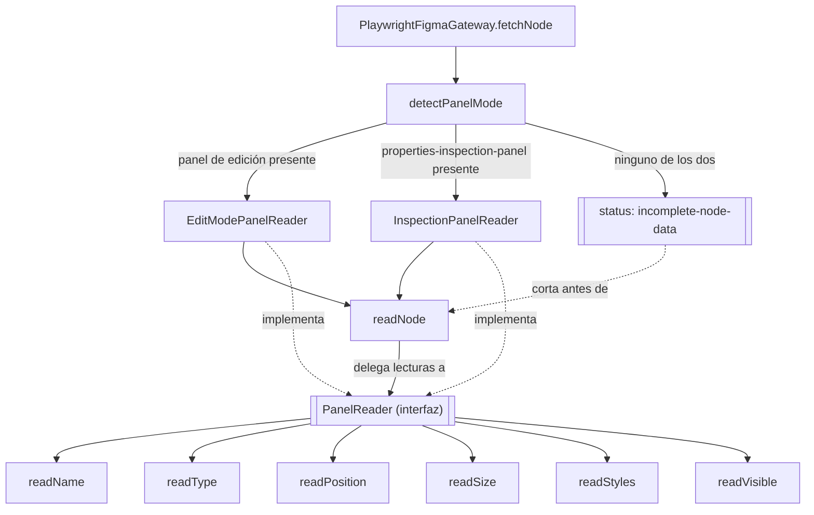

# ADR-panel-reader-bridge

## Contexto

`PlaywrightFigmaGateway` (definido en [`ADR-figma-scraper-core`](./ADR-figma-scraper-core.md))
lee los datos de un nodo scrapeando el DOM del panel de propiedades de
Figma. Se confirmó corriendo contra sesiones reales que **el DOM de ese
panel cambia por completo según el modo en que Figma renderiza el archivo**,
no solo según el tipo de nodo seleccionado:

- **Modo edición** (usuario con permiso de editor): panel con inputs
  editables (`x-y-inputs-row`, `transform-width`, `consumed-style-panel`
  para fill/stroke/typography). No expone `fontFamily` ni `fontWeight` como
  campos separados — clickear el nombre de un estilo tipográfico abre un
  selector de estilos del archivo, no un detalle de sus valores.
- **Modo inspección** (usuario viewer en un archivo cuya organización tiene
  el plan que lo habilita): panel de solo lectura con pares
  `inspectionPropertyRow` uniformes (`Width`, `Height`, `Font`, `Weight`,
  `Style`, `Size`, `Line height`, `Letter spacing`, `Case`, color en hex
  directo). Cubre datos que el modo edición no expone.
- **Dev Mode pagado** (`&m=dev`): en el plan actual del usuario, entrar a un
  archivo propio con ese parámetro dispara un modal de upgrade en vez de
  mostrar el panel — no se pudo confirmar su DOM. Se documenta como modo
  esperable a futuro, no implementado.

Cuál de estos modos ve un usuario dado no depende únicamente de su rol en el
archivo: en la misma sesión, un archivo propio (editor) mostró el modal de
upgrade al forzar `&m=dev`, mientras que un archivo ajeno de solo view
mostró el panel de inspección sin pedir upgrade — depende del plan de la
organización dueña del archivo, algo que el gateway no controla ni puede
forzar de forma confiable vía URL.

[`specs/obtener_informacion_figma.spec`](../specs/obtener_informacion_figma.spec)
ya define un tercer escenario, todavía sin un archivo real que lo confirme:
un usuario con permiso de solo view en un archivo cuya organización no
habilita el panel de inspección. Nadie sabe hoy qué muestra Figma en ese
caso — puede no haber ningún panel legible con datos del nodo — así que el
spec pide un error explícito (`INCOMPLETE_NODE_DATA`) en vez de asumir un
resultado parcial sin poder validarlo.

## Decisión

- **Patrón — Bridge.** Se separa la abstracción de alto nivel (`readNode`,
  que arma un `RawFigmaNode` con la forma estable que espera el core) de la
  implementación concreta de cómo leer cada campo del DOM (`PanelReader`,
  intercambiable según el modo detectado). `readNode` no cambia según el
  modo; solo delega cada lectura (`readPosition`, `readSize`, `readStyles`,
  `readType`) al `PanelReader` activo. Se prefirió sobre "un método completo
  por modo con un if/switch" porque ese enfoque duplicaría la lógica de
  armado del `RawFigmaNode` (recorrido de hijos, manejo de `visible`, id,
  name) en cada rama, cuando esa parte es idéntica entre modos — solo el
  cómo leer cada campo cambia.

- **Detección de modo, no selección forzada.** El gateway navega a la URL
  del nodo tal cual (sin agregar `&m=dev` ni ningún parámetro), y detecta
  qué panel quedó presente en el DOM (`properties-inspection-panel` existe →
  modo inspección; si no, asume modo edición). No fuerza ningún modo porque
  no hay forma confiable de garantizar que un modo forzado esté disponible
  (ver Contexto: el mismo usuario vio comportamientos distintos en dos
  archivos).

- **`PanelReader` es la unidad de extensión para modos futuros.** Sumar Dev
  Mode pagado (cuando se pueda confirmar su DOM) es agregar un
  `DevModePanelReader` nuevo y una rama más en la detección de modo — no
  toca `readNode` ni los otros `PanelReader`.

- **Modo `"none"` corta antes de `readNode`, no entra al `PanelReader`.**
  Cuando `detectPanelMode` no encuentra ni el panel de edición ni el de
  inspección, `fetchNode` devuelve directamente el status que el core mapea
  a `INCOMPLETE_NODE_DATA` (ver `ADR-figma-scraper-core`), sin instanciar
  ningún `PanelReader` ni llamar a `readNode`. Alternativa descartada: un
  `NullPanelReader` cuyos métodos devuelven siempre vacío, dejando que
  `readNode` corra igual — significaría gastar el recorrido completo del
  árbol (potencialmente varios minutos en un archivo grande, ver duración
  medida en `ADR-figma-scraper-core`) para un resultado que de entrada se
  sabe va a ser un error.

- **Organización — carpeta dedicada.** `panel-readers/` dentro de
  `src/adapters/playwright/`, con un archivo por modo más la interfaz
  común. Separa claramente "selectores DOM por modo" (volátil, cambia si
  Figma rediseña un panel puntual) del resto del gateway (`readNode`,
  recorrido de hijos, síntesis del nodo CANVAS), que no depende de qué modo
  esté activo.

- **Volatilidad:**
  - **Volátil:** los selectores DOM de cada modo — ya se vio inestabilidad
    real en el modo edición (tipos de nodo sin cobertura completa,
    fill/stroke solo confirmados cuando el nodo tiene un estilo con nombre
    aplicado). Vive encapsulado dentro de cada `PanelReader`.
  - **Estable:** la forma de `RawFigmaNode` y el recorrido del árbol
    (`readNode`, `expandAndListChildren`, síntesis del nodo CANVAS) — no
    cambia entre modos, ya está probado contra sesiones reales.

- **`FigmaFetchResult` gana un status nuevo.** `ADR-figma-scraper-core`
  define `FigmaFetchResult<T>` con `"ok" | "not-found-or-no-access" |
  "session-expired"` — ninguno cubre "el nodo existe pero no hay panel
  legible". Se agrega `"incomplete-node-data"`, que el core mapea al código
  de error `INCOMPLETE_NODE_DATA` ya declarado en ese mismo ADR. A
  diferencia del resto de las decisiones de este documento, esta sí toca el
  contrato del puerto `FigmaGateway`, no solo la implementación interna de
  `PlaywrightFigmaGateway`.

- **Relaciones:**
  - `RELATED_TO` [`ADR-figma-scraper-core`](./ADR-figma-scraper-core.md) —
    extiende la implementación interna de `PlaywrightFigmaGateway`; agrega
    un status a `FigmaFetchResult`, el único punto donde este documento
    toca el contrato del puerto que ese ADR ya define.
  - `DERIVES_FROM` [`specs/obtener_informacion_figma.spec`](../specs/obtener_informacion_figma.spec)

## Interfaces

### Diagrama (mermaid)



### TypeScript

```typescript
import type { Locator, Page } from "playwright";
import type { CommonStyles, TypographyStyles } from "../../../figma/model";

// Cada método recibe la fila del layers panel y/o el panel de propiedades
// ya seleccionados; el PanelReader no navega ni hace click, solo lee.
export interface PanelReader {
  readName(row: Locator): Promise<string>;
  readType(row: Locator): Promise<string>;
  readVisible(row: Locator): Promise<boolean>;
  readPosition(panel: Locator): Promise<{ x: number | null; y: number | null }>;
  readSize(panel: Locator): Promise<{ width: number | null; height: number | null }>;
  readStyles(panel: Locator): Promise<CommonStyles & { typography?: TypographyStyles }>;
}

// "none": ni el panel de edición ni el de inspección quedaron presentes en
// el DOM tras cargar la página — no hay ningún PanelReader para ese caso.
export type PanelMode = "edit" | "inspection" | "none";

// Corre una sola vez por página cargada (no por nodo): el modo no cambia
// entre nodos de un mismo archivo en la misma sesión.
export function detectPanelMode(page: Page): Promise<PanelMode>;

// No se llama con mode "none" — ver fetchNode en el Usage example: ese caso
// corta antes de necesitar un PanelReader.
export function createPanelReader(mode: "edit" | "inspection"): PanelReader;
```

### Usage example

```typescript
// dentro de PlaywrightFigmaGateway.fetchNode, una sola vez por page.goto():
async fetchNode(fileKey: string, nodeId: string, session: FigmaSession): Promise<FigmaFetchResult<RawFigmaNode>> {
  const url = `https://www.figma.com/design/${fileKey}?node-id=${nodeId.replace(":", "-")}`;
  return this.withPage(session, url, async (page) => {
    const mode = await detectPanelMode(page);
    if (mode === "none") return { status: "incomplete-node-data" };

    const reader = createPanelReader(mode);
    const node = await this.readNode(page, nodeId, reader);
    return node ? { status: "ok", value: node } : { status: "not-found-or-no-access" };
  });
}

// readNode ya no sabe nada de selectores concretos:
private async readNode(page: Page, nodeId: string, reader: PanelReader): Promise<RawFigmaNode | null> {
  const row = page.locator(SELECTORS.layerRow(nodeId));
  if ((await row.count()) === 0) return null;
  await row.click();

  const panel = page.locator(SELECTORS.propertiesPanel);
  const name = await reader.readName(row);
  const type = await reader.readType(row);
  const visible = await reader.readVisible(row);
  const { x, y } = await reader.readPosition(panel);
  const { width, height } = await reader.readSize(panel);
  const styles = await reader.readStyles(panel);

  const childIds = await this.expandAndListChildren(page, nodeId);
  const children = [];
  for (const childId of childIds) {
    const child = await this.readNode(page, childId, reader);
    if (child) children.push(child);
  }

  return { id: nodeId, name, type, position: { x, y }, size: { width, height }, visible, styles, image: null, children };
}
```

## Ver también

- [`ADR-figma-scraper-core`](./ADR-figma-scraper-core.md) — define `FigmaGateway` como puerto y `PlaywrightFigmaGateway` como su adapter concreto; este documento extiende la estructura interna de ese adapter.
- [`specs/obtener_informacion_figma.spec`](../specs/obtener_informacion_figma.spec) — escenarios por nivel de acceso que motivan la existencia de más de un `PanelReader`.
