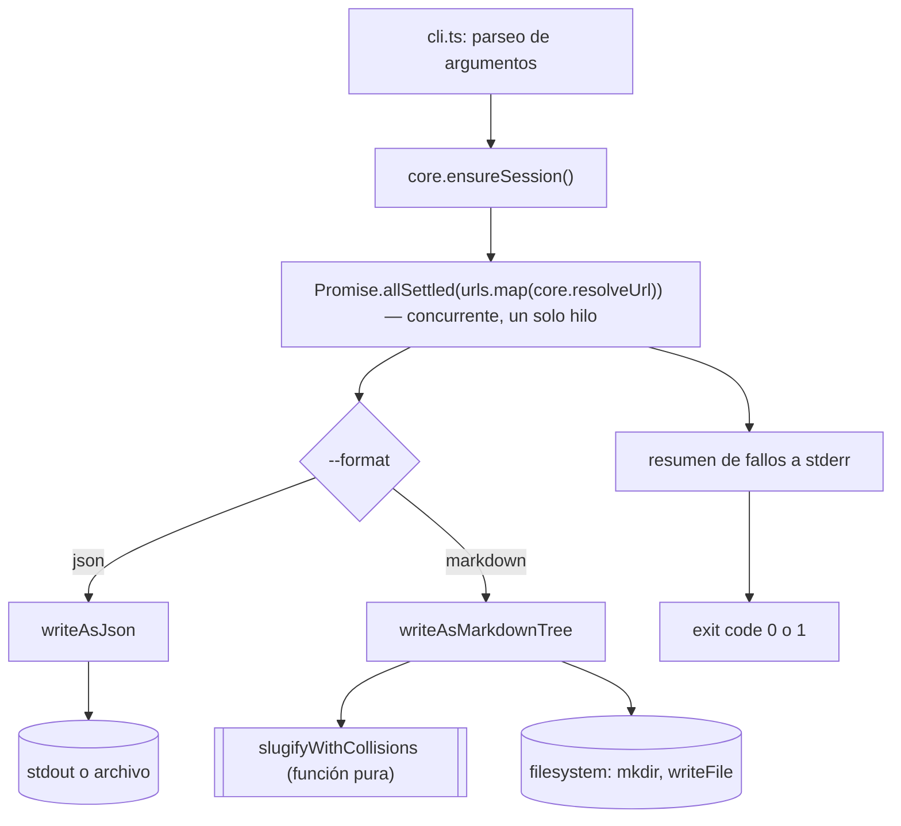

# ADR-figtools-cli

## Contexto

Se necesita un CLI (`@figtools/cli`) que envuelva `@figtools/core` para resolver
una o varias URLs de Figma desde la línea de comandos, escribiendo el
resultado en `json` o en un árbol de archivos `markdown` navegable pensado
para que un LLM lo use como fuente de datos. Los criterios de aceptación de
este comportamiento ya están definidos en
[`specs/resolver_urls_de_figma_por_linea_de_comandos.spec`](../specs/resolver_urls_de_figma_por_linea_de_comandos.spec).

El core ya expone `resolveUrl(url)` (resuelve una URL, dispara login
automático la primera vez que no hay sesión) y `reauthenticate()` (fuerza un
login nuevo sin importar si la sesión actual sigue siendo válida). Ninguno de
los dos alcanza para "asegurar que hay sesión, sin forzar un login si ya
existe una válida" — un comportamiento que el CLI necesita para no disparar
varios logins interactivos superpuestos cuando procesa varias URLs de forma
concurrente sin sesión guardada. Node.js es single-threaded: varias
`resolveUrl()` corriendo "en simultáneo" no ejecutan en paralelo real (no hay
múltiples hilos), sino que se intercalan cooperativamente en el mismo hilo
vía el event loop cada vez que una hace `await` en una operación de I/O. Aun
así, el riesgo de login duplicado es real: si ninguna URL tiene sesión
guardada, cada una podría llegar a "no hay sesión, disparo login" antes de
que la primera termine el suyo, abriendo varios navegadores headed a la vez.

## Decisión

- **Formato de salida — dos funciones, sin interfaz formal.** `writeAsJson(result, dest)`
  y `writeAsMarkdownTree(result, dest)` son funciones independientes; el CLI
  elige cuál llamar con un simple `switch`/mapa de `--format` a la función
  correcta. No se define una interfaz `OutputWriter` ni un Strategy formal
  porque las dos variantes casi no comparten complejidad interna real: `json`
  es serialización directa de `FigmaScrapeResult`; `markdown` es un recorrido
  recursivo del árbol de nodos con cálculo de slugs, resolución de colisiones
  entre hermanos, y decisión de archivo-vs-carpeta por nodo. Una interfaz
  común que no oculta ningún comportamiento compartido real es indirección
  sin beneficio (concepto de "shallow module" de *A Philosophy of Software
  Design*, cap. 4; y la advertencia de *Functional Design and Architecture*,
  cap. 2 y 14, contra generalizar antes de que exista una necesidad real,
  usando el Expression Problem como ejemplo de abstracción prematura sin
  beneficio concreto a la vista). Si en el futuro aparece un tercer formato
  con la misma forma interna que uno de los dos existentes, ahí sí se
  factoriza lo común real — no antes.

- **El writer de markdown separa nombrado de escritura a disco.**
  `slugifyWithCollisions(names: string[]): string[]` es una función pura,
  testeable con arrays de strings sin tocar el filesystem. `writeAsMarkdownTree`
  recorre el árbol de nodos y llama a esa función para nombrar cada nivel de
  hijos, y hace el I/O (`mkdir`, `writeFile`). Dos piezas de conocimiento
  distintas (cómo se nombra un nodo vs. cómo se escribe a disco) viven en
  dos lugares distintos — la primera no se filtra a la segunda, siguiendo
  information hiding (*A Philosophy of Software Design*, cap. 5): cada pieza
  de conocimiento (aquí, "cómo resolver colisiones de nombre" y "cómo volcar
  un árbol a directorios") debe encapsularse en un solo lugar para no crear
  una dependencia oculta entre ambas si una cambia.

- **Resolución de URLs — concurrente, con una sesión asegurada antes de arrancar.**
  El CLI llama a `ensureSession()` (ver punto siguiente) una única vez antes
  de lanzar la resolución de las N URLs con `Promise.allSettled`. Esto es
  concurrencia cooperativa de un solo hilo (event loop de Node.js
  intercalando las esperas de I/O de cada `resolveUrl()`), no paralelismo con
  múltiples hilos — la distinción importa porque cambia qué se puede asumir
  sobre el orden de ejecución: nada corre "al mismo tiempo" en sentido
  estricto, pero tampoco hay un orden secuencial garantizado entre las N
  URLs. Una vez que hay sesión garantizada, las N resoluciones concurrentes
  no arriesgan login duplicado, porque ninguna de ellas necesita autenticar
  de nuevo. Sin esta sesión asegurada de antemano, lanzar las N
  `resolveUrl()` sin sesión guardada podría disparar varios logins
  interactivos superpuestos (varios navegadores headed abriéndose antes de
  que el primer login termine) — comportamiento que ni el ADR del core ni el
  usuario esperan.

- **Se amplía el contrato público de `@figtools/core` con `ensureSession()`.**
  `FigmaScraperCore` gana un tercer método público:
  `ensureSession(): Promise<Result<FigmaSession, FigmaScraperError>>`. Dispara
  el login interactivo solo si no hay sesión guardada (a diferencia de
  `reauthenticate()`, que siempre fuerza un login nuevo sin importar el
  estado de la sesión actual). Es funcionalidad que pertenece al contrato del
  servicio, no un hack del lado del consumidor — el propio core ya tiene esta
  lógica implementada como la función privada `ensureSession` dentro de
  `createFigmaScraperCore`, solo hace falta exponerla. *Functional Design and
  Architecture* (cap. 13.2, comparación de patrones de Dependency Inversion)
  compara Service Handle contra Free monad/ReaderT/GADT/Final-Tagless para
  el mismo tipo de problema (inyectar o exponer una capacidad de un
  servicio), y concluye que Service Handle es la opción más simple y con
  menos código de infraestructura cuando alcanza — aquí alcanza: es agregar
  un método más al mismo Service Handle que ya es `FigmaScraperCore`, sin
  necesidad de una abstracción nueva.

- **Orquestación multi-URL — secuencial en la sesión, concurrente en la resolución.**
  Paso 1: `ensureSession()` una vez (secuencial, bloqueante, se espera con
  `await` antes de seguir). Paso 2: las N llamadas a `resolveUrl(url)` se
  lanzan juntas y se esperan con `Promise.allSettled`, cada una independiente
  — el fallo de una no cancela ni bloquea a las demás (ya requerido por el
  spec). Sigue el mismo principio del patrón de *Functional Design and
  Architecture* cap. 9 (asegurar el recurso compartido antes de arrancar el
  trabajo concurrente) sin necesitar STM ni primitivas de concurrencia
  explícitas: en Node.js/TypeScript, con un solo hilo de por medio, asegurar
  la sesión antes del `Promise.allSettled` ya es suficiente porque no hay
  memoria compartida mutable entre las N resoluciones más allá de la sesión
  ya persistida en disco por `CookieSessionStore`.

- **Si `ensureSession()` falla, se aborta sin intentar ninguna URL.** El
  spec original no cubre este caso (solo describe el fallo de una URL
  individual durante la resolución, no un fallo de la sesión compartida
  antes de arrancar). Si no se puede garantizar una sesión válida, todas las
  URLs fallarían de la misma forma, así que `resolveAll` no llama a
  `resolveUrl` para ninguna: devuelve las N URLs marcadas con el error de
  sesión que devolvió `ensureSession()`, sin intentar la resolución
  individual de cada una.

- **Volatilidad:**
  - **Volátil:** el formato de salida (hoy `json`/`markdown`; el spec ya
    define ambos como soluciones concretas, no como el requerimiento real —
    el requerimiento real es "servir la información en la forma que el
    consumidor necesite", ver *Righting Software* cap. 2 sobre "soluciones
    disfrazadas de requerimientos"). Vive en `packages/cli/src/output/`,
    fuera de la orquestación de resolución de URLs.
  - **Estable:** el contrato de `@figtools/core` (`resolveUrl`,
    `reauthenticate`, `ensureSession`) y el modelo de datos
    (`FigmaScrapeResult`, `FigmaNode`, `FigmaPage`) que el CLI consume sin
    conocer cómo se obtienen.

- **Organización — por capa dentro del paquete, no por feature.** `src/cli.ts`
  (parseo de argumentos y orquestación), `src/output/json-writer.ts`,
  `src/output/markdown-writer.ts`, `src/output/slugify.ts` — organización por
  responsabilidad técnica (parseo, orquestación, escritura), consistente con
  que hoy solo hay un flujo de negocio ("resolver URLs de Figma"), no
  múltiples features que ameriten carpetas por dominio.

- **Parseo de argumentos y decisión de destino — funciones puras, separadas del entrypoint.**
  `cli.ts` no debe acoplar el parseo a `process.argv`/`process.exit`
  directamente, porque eso impide testear el parseo sin ejecutar el proceso
  real. Se extraen dos funciones puras:
  - `parseArgs(argv: string[])`: recibe los argumentos ya recortados (sin
    `node` ni la ruta del script) y devuelve la configuración parseada (URLs,
    `format`, `outputPath`, `quiet`, o el subcomando `login`) o un error de
    validación — nunca lee `process.argv` ni imprime nada por su cuenta.
  - `decideOutputTarget(outputPath: string | undefined, format: "json" | "markdown")`:
    decide si `outputPath` se interpreta como archivo o carpeta (o si la
    extensión no es soportada), sin tocar el filesystem.
  `cli.ts` queda como un entrypoint delgado: llama a estas funciones, orquesta
  `resolveAll` y los writers, e imprime/hace `process.exit` al final. Esto es
  lo mismo que separar la lógica pura y testeable de sus efectos, ya aplicado
  en `slugifyWithCollisions` para el writer de markdown.

- **Relaciones:**
  - `DERIVES_FROM` [`specs/resolver_urls_de_figma_por_linea_de_comandos.spec`](../specs/resolver_urls_de_figma_por_linea_de_comandos.spec)
  - `RELATED_TO` [`packages/core/adr/ADR-figtools-core.md`](../../core/adr/ADR-figtools-core.md)
    — este ADR amplía el contrato público de `FigmaScraperCore` definido ahí,
    agregando `ensureSession()`.

## Interfaces

### Diagrama (mermaid)



### TypeScript

```typescript
import type {
  FigmaScraperCore,
  FigmaScrapeResult,
  FigmaNode,
  FigmaScraperError,
  Result,
} from "@figtools/core";

// Ampliación del contrato de @figtools/core (packages/core/src/figma/core.ts)
export interface FigmaScraperCore {
  resolveUrl(url: string): Promise<Result<FigmaScrapeResult, FigmaScraperError>>;
  reauthenticate(): Promise<Result<FigmaSession, FigmaScraperError>>;

  // Nuevo: dispara login solo si no hay sesión guardada. A diferencia de
  // reauthenticate(), no fuerza un login nuevo si la sesión actual es válida.
  ensureSession(): Promise<Result<FigmaSession, FigmaScraperError>>;
}

// packages/cli/src/output/slugify.ts
// Función pura: nombra cada nodo por el slug de su `name` en Figma, agregando
// un sufijo [2], [3]... a partir del segundo hermano con el mismo nombre.
export function slugifyWithCollisions(names: string[]): string[];

// packages/cli/src/cli.ts
export type OutputFormat = "json" | "markdown";

export interface ParsedArgs {
  urls: string[];
  format: OutputFormat;
  outputPath?: string;
  quiet: boolean;
  command?: "login";
}

export type ParseArgsResult = Result<ParsedArgs, { code: "VALIDATION_NO_URLS" | "VALIDATION_UNSUPPORTED_EXTENSION"; message: string }>;

// Recibe los argumentos ya recortados (sin `node` ni la ruta del script).
// No lee process.argv ni imprime nada — función pura.
export function parseArgs(argv: string[]): ParseArgsResult;

export type OutputTarget =
  | { kind: "stdout" }
  | { kind: "file"; path: string }
  | { kind: "directory"; path: string }
  | { kind: "unsupported-extension"; extension: string };

// Decide si outputPath se interpreta como archivo, carpeta, o extensión no
// soportada — sin tocar el filesystem. Con format "markdown", nunca devuelve
// "file": siempre "directory" (ver spec).
export function decideOutputTarget(
  outputPath: string | undefined,
  format: OutputFormat,
): OutputTarget;

// packages/cli/src/output/markdown-writer.ts
export interface MarkdownWriterOptions {
  outputDir: string;
}
// Recorre el árbol de un FigmaScrapeResult y escribe el árbol de carpetas/archivos
// descrito en el spec (index.md para el nodo raíz, node hoja = archivo, nodo con
// hijos = carpeta con su propio index.md), dentro de una subcarpeta por fileKey.
export function writeAsMarkdownTree(
  fileKey: string,
  result: FigmaScrapeResult,
  options: MarkdownWriterOptions,
): Promise<void>;

// packages/cli/src/output/json-writer.ts
export interface JsonWriterOptions {
  // Ausente: escribe a stdout. Presente: escribe al archivo o directorio indicado.
  outputPath?: string;
}
export function writeAsJson(
  fileKey: string,
  result: FigmaScrapeResult,
  options: JsonWriterOptions,
): Promise<void>;

// packages/cli/src/resolve-all.ts
export interface UrlResolution {
  url: string;
  result: Result<FigmaScrapeResult, FigmaScraperError>;
}

// Asegura la sesión una vez, y solo después resuelve las N URLs de forma
// concurrente (Promise.allSettled), no en paralelo real: Node.js es
// single-threaded.
export async function resolveAll(
  core: FigmaScraperCore,
  urls: string[],
): Promise<UrlResolution[]>;
```

### Usage example

```typescript
import { createFigmaScraperCore, PlaywrightFigmaGateway, PlaywrightLogin, CookieSessionStore } from "@figtools/core";
import { resolveAll } from "./resolve-all";
import { writeAsJson } from "./output/json-writer";
import { writeAsMarkdownTree } from "./output/markdown-writer";

const core = createFigmaScraperCore({
  sessionStore: new CookieSessionStore(),
  interactiveLogin: new PlaywrightLogin(),
  gateway: new PlaywrightFigmaGateway(),
});

// resolveAll asegura la sesión una vez adentro, antes de resolver las URLs
// de forma concurrente.
const resolutions = await resolveAll(core, urls);

let hadFailure = false;
for (const { url, result } of resolutions) {
  if (!result.ok) {
    hadFailure = true;
    console.error(`${url}: ${result.error.code} — ${result.error.message}`);
    continue;
  }

  const fileKey = parseFileKeyFrom(url); // ver ADR-figtools-core para el parseo de URL
  if (format === "markdown") {
    await writeAsMarkdownTree(fileKey, result.value, { outputDir });
  } else {
    await writeAsJson(fileKey, result.value, { outputPath });
  }
}

process.exit(hadFailure ? 1 : 0);
```

## Ver también

- [`specs/resolver_urls_de_figma_por_linea_de_comandos.spec`](../specs/resolver_urls_de_figma_por_linea_de_comandos.spec)
  — escenarios de aceptación que motivan cada decisión de este documento.
- [`packages/core/adr/ADR-figtools-core.md`](../../core/adr/ADR-figtools-core.md)
  — define `FigmaScraperCore` como Service Handle; este documento amplía su
  contrato con `ensureSession()`.
