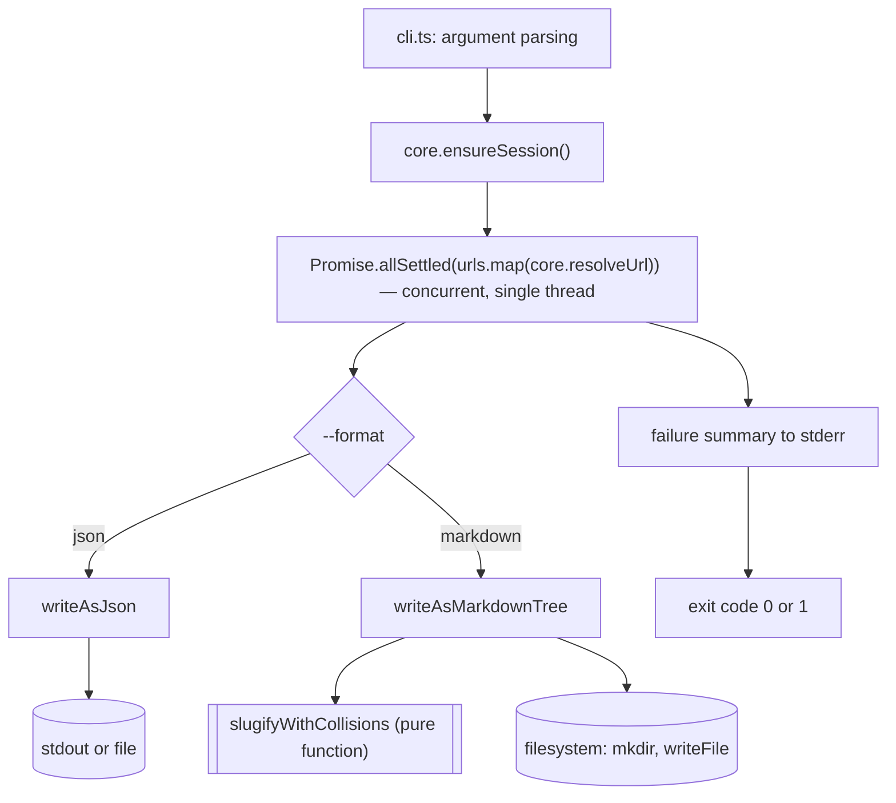

# ADR-figtools-cli

## Context

We need a CLI (`@figtools/cli`) that wraps `@figtools/core` to resolve one
or more Figma URLs from the command line, writing the result as `json` or
as a navigable `markdown` file tree meant to be used by an LLM as a data
source. The acceptance criteria for this behavior are already defined in
[`specs/resolve_figma_urls_from_cli.spec`](../specs/resolve_figma_urls_from_cli.spec).

The core already exposes `resolveUrl(url)` (resolves a URL, triggers
automatic login the first time there's no session) and `reauthenticate()`
(forces a new login regardless of whether the current session is still
valid). Neither of the two is enough for "make sure there's a session,
without forcing a login if a valid one already exists" — a behavior the CLI
needs so it doesn't trigger several overlapping interactive logins when it
processes several URLs concurrently with no saved session. Node.js is
single-threaded: several `resolveUrl()` calls running "at the same time"
don't execute in real parallel (there's no multiple threads), they
cooperatively interleave on the same thread via the event loop each time one
of them `await`s an I/O operation. Even so, the risk of a duplicate login is
real: if no URL has a saved session, each one could reach "no session,
trigger login" before the first one finishes its own, opening several
headed browsers at once.

## Decision

- **Output format — two functions, no formal interface.** `writeAsJson(result, dest)`
  and `writeAsMarkdownTree(result, dest)` are independent functions; the CLI
  chooses which one to call with a simple `switch`/map from `--format` to
  the right function. No `OutputWriter` interface or formal Strategy is
  defined because the two variants barely share any real internal
  complexity: `json` is direct serialization of `FigmaScrapeResult`;
  `markdown` is a recursive traversal of the node tree with slug
  computation, sibling collision resolution, and per-node
  file-vs-folder decisions. A common interface that doesn't hide any real
  shared behavior is indirection with no benefit (the "shallow module"
  concept from *A Philosophy of Software Design*, ch. 4; and the warning
  from *Functional Design and Architecture*, ch. 2 and 14, against
  generalizing before a real need exists, using the Expression Problem as
  an example of premature abstraction with no concrete benefit in sight).
  If a third format appears in the future with the same internal shape as
  one of the two existing ones, that's when the real common part gets
  factored out — not before.

- **The markdown writer separates naming from writing to disk.**
  `slugifyWithCollisions(names: string[]): string[]` is a pure function,
  testable with arrays of strings without touching the filesystem.
  `writeAsMarkdownTree` walks the node tree and calls that function to name
  each level of children, and does the I/O (`mkdir`, `writeFile`). Two
  distinct pieces of knowledge (how a node is named vs. how it's written to
  disk) live in two separate places — the first doesn't leak into the
  second, following information hiding (*A Philosophy of Software Design*,
  ch. 5): each piece of knowledge (here, "how to resolve name collisions"
  and "how to dump a tree to directories") should be encapsulated in a
  single place so a change to one doesn't create a hidden dependency on the
  other.

- **URL resolution — concurrent, with a session secured before starting.**
  The CLI calls `ensureSession()` (see next point) exactly once before
  launching resolution of the N URLs with `Promise.allSettled`. This is
  single-threaded cooperative concurrency (Node.js's event loop
  interleaving each `resolveUrl()`'s I/O waits), not multi-threaded
  parallelism — the distinction matters because it changes what can be
  assumed about execution order: nothing runs "at the same time" in the
  strict sense, but there's also no guaranteed sequential order between the
  N URLs. Once a session is guaranteed, the N concurrent resolutions don't
  risk a duplicate login, because none of them needs to authenticate again.
  Without this session secured upfront, launching the N `resolveUrl()`
  calls with no saved session could trigger several overlapping interactive
  logins (several headed browsers opening before the first login finishes)
  — behavior neither the core's ADR nor the user expects.

- **`@figtools/core`'s public contract is extended with `ensureSession()`.**
  `FigmaScraperCore` gains a third public method:
  `ensureSession(): Promise<Result<FigmaSession, FigmaScraperError>>`. It
  triggers the interactive login only if there's no saved session (unlike
  `reauthenticate()`, which always forces a new login regardless of the
  current session's state). This is functionality that belongs to the
  service's contract, not a hack on the consumer's side — the core itself
  already has this logic implemented as the private `ensureSession`
  function inside `createFigmaScraperCore`, it just needs to be exposed.
  *Functional Design and Architecture* (ch. 13.2, comparison of Dependency
  Inversion patterns) compares Service Handle against Free
  monad/ReaderT/GADT/Final-Tagless for the same kind of problem (injecting
  or exposing a service's capability), and concludes Service Handle is the
  simplest option with the least infrastructure code when it's enough —
  here it's enough: it's adding one more method to the same Service Handle
  that `FigmaScraperCore` already is, with no need for a new abstraction.

- **Multi-URL orchestration — sequential for the session, concurrent for
  resolution.** Step 1: `ensureSession()` once (sequential, blocking,
  awaited before continuing). Step 2: the N calls to `resolveUrl(url)` are
  launched together and awaited with `Promise.allSettled`, each one
  independent — one failing doesn't cancel or block the others (already
  required by the spec). This follows the same principle as the pattern in
  *Functional Design and Architecture* ch. 9 (securing the shared resource
  before starting concurrent work) without needing STM or explicit
  concurrency primitives: in Node.js/TypeScript, with only one thread
  involved, securing the session before `Promise.allSettled` is already
  enough because there's no shared mutable memory between the N
  resolutions beyond the session already persisted to disk by
  `CookieSessionStore`.

- **If `ensureSession()` fails, abort without attempting any URL.** The
  original spec doesn't cover this case (it only describes an individual
  URL's failure during resolution, not a failure of the shared session
  before starting). If a valid session can't be guaranteed, all URLs would
  fail the same way, so `resolveAll` doesn't call `resolveUrl` for any of
  them: it returns the N URLs marked with the session error `ensureSession()`
  returned, without attempting individual resolution for each one.

- **Volatility:**
  - **Volatile:** the output format (today `json`/`markdown`; the spec
    already defines both as concrete solutions, not as the real
    requirement — the real requirement is "serve the information in the
    shape the consumer needs", see *Righting Software* ch. 2 on "solutions
    disguised as requirements"). Lives in `packages/cli/src/output/`,
    outside the URL resolution orchestration.
  - **Stable:** `@figtools/core`'s contract (`resolveUrl`,
    `reauthenticate`, `ensureSession`) and the data model
    (`FigmaScrapeResult`, `FigmaNode`, `FigmaPage`) the CLI consumes
    without knowing how it's obtained.

- **Organization — by layer within the package, not by feature.** `src/cli.ts`
  (argument parsing and orchestration), `src/output/json-writer.ts`,
  `src/output/markdown-writer.ts`, `src/output/slugify.ts` — organized by
  technical responsibility (parsing, orchestration, writing), consistent
  with the fact that today there's only one business flow ("resolve Figma
  URLs"), not multiple features that would warrant folders by domain.

- **Argument parsing and destination decision — pure functions, separate
  from the entrypoint.** `cli.ts` shouldn't couple parsing directly to
  `process.argv`/`process.exit`, because that prevents testing the parsing
  without running the real process. Two pure functions are extracted:
  - `parseArgs(argv: string[])`: receives the arguments already trimmed
    (without `node` or the script path) and returns the parsed
    configuration (URLs, `format`, `outputPath`, `quiet`, or the `login`
    subcommand), a help/version request already rendered as text
    (`ParseArgsInfo`), or a validation error — it never reads
    `process.argv`, never calls `process.exit`, and never prints anything
    on its own.
  - `decideOutputTarget(outputPath: string | undefined, format: "json" | "markdown")`:
    decides whether `outputPath` is interpreted as a file or a folder (or
    whether the extension isn't supported), without touching the
    filesystem.
  `cli.ts` remains a thin entrypoint: it calls these functions, orchestrates
  `resolveAll` and the writers, and prints/calls `process.exit` at the end.
  This is the same as separating pure, testable logic from its effects,
  already applied in `slugifyWithCollisions` for the markdown writer.

- **Argument parsing library — commander, wrapped to stay pure.** This
  ADR previously left the choice between manual parsing and a library as
  an open question (see `pending-decisions.md` — now resolved). `commander`
  was chosen over `yargs`, `cac`, and `clipanion`: it's the de facto
  standard, has zero runtime dependencies, bundles native TypeScript
  types, is very actively maintained, and its `Option.choices()` gives
  native validation for `--format` (`yargs` v18 dropped its bundled Node
  types in favor of an outdated `@types/yargs`; `clipanion` has the
  purest design of the four but had no commits in ~2 years and never left
  release-candidate status; `cac` is the lightest and parses purely by
  default but has no native choices validation).

  By default, commander calls `process.exit()` on `--help`/`--version`/a
  parse error, and prints directly to stdout/stderr — both of which would
  break `parseArgs`'s existing purity guarantee. `createProgram()` (in
  `cli.ts`) neutralizes both: `program.exitOverride()` makes commander
  throw a `CommanderError` instead of exiting, and
  `program.configureOutput({ writeOut, writeErr })` captures everything
  commander would have printed into an in-memory string instead of
  writing it to a real stream. `parseArgs` inspects the thrown error's
  `code` (`"commander.helpDisplayed"`, `"commander.version"`,
  `"commander.missingArgument"`, or anything else) to decide whether to
  return an info result (help/version, with the captured text as
  `output`) or a validation error — the caller (`main()`) is the one that
  actually writes that captured text to stdout/stderr and calls
  `process.exit()`.

- **`resolve` as commander's default command, `login` as the only named
  subcommand.** To preserve the exact existing CLI surface
  (`figtools <urls...> [flags]` with no command name, and `figtools login`
  as a separate case) without a breaking change, URL resolution is
  registered as `program.command("resolve", { isDefault: true })` instead
  of living directly on the root `program`. commander dispatches to the
  default command automatically whenever the first argument doesn't match
  a known subcommand name (see `_defaultCommandName` in commander's
  source) — so `figtools <url>` keeps working without writing
  `figtools resolve <url>`, while `figtools login` still resolves to its
  own subcommand. Each subcommand's `.action()` callback captures its
  parsed result into a closure variable that `parseArgs` reads after
  `program.parse()` returns, since commander has no single object that
  reports "which subcommand ended up running" ahead of time.

- **Relationships:**
  - `DERIVES_FROM` [`specs/resolve_figma_urls_from_cli.spec`](../specs/resolve_figma_urls_from_cli.spec)
  - `RELATED_TO` [`packages/core/adr/ADR-figtools-core.md`](../../core/adr/ADR-figtools-core.md)
    — this ADR extends the public contract of `FigmaScraperCore` defined
    there, adding `ensureSession()`.

## Interfaces

### Diagram (mermaid)



### TypeScript

```typescript
import type {
  FigmaScraperCore,
  FigmaScrapeResult,
  FigmaNode,
  FigmaScraperError,
  Result,
} from "@figtools/core";

// Extension of @figtools/core's contract (packages/core/src/figma/core.ts)
export interface FigmaScraperCore {
  resolveUrl(url: string): Promise<Result<FigmaScrapeResult, FigmaScraperError>>;
  reauthenticate(): Promise<Result<FigmaSession, FigmaScraperError>>;

  // New: triggers login only if there's no saved session. Unlike
  // reauthenticate(), it doesn't force a new login if the current session
  // is valid.
  ensureSession(): Promise<Result<FigmaSession, FigmaScraperError>>;
}

// packages/cli/src/output/slugify.ts
// Pure function: names each node after the slug of its Figma `name`, adding
// a [2], [3]... suffix starting from the second sibling with the same name.
export function slugifyWithCollisions(names: string[]): string[];

// packages/cli/src/cli.ts
export type OutputFormat = "json" | "markdown";

export interface ParsedArgs {
  urls: string[];
  format: OutputFormat;
  outputPath?: string;
  quiet: boolean;
  command?: "login";
}

type ParseArgsError = {
  code: "VALIDATION_NO_URLS" | "VALIDATION_UNSUPPORTED_EXTENSION" | "COMMANDER_ERROR";
  message: string;
};

// help/version end parsing without being a validation error: commander
// already generated the text (help or version number) and expects the
// caller to print it and exit with code 0, instead of treating it as a
// failure.
type ParseArgsInfo = { code: "HELP_DISPLAYED" | "VERSION_DISPLAYED"; output: string };

export type ParseArgsResult =
  | { ok: true; value: ParsedArgs }
  | { ok: false; error: ParseArgsError }
  | { ok: false; info: ParseArgsInfo };

// Receives the arguments already trimmed (without `node` or the script path).
// Doesn't read process.argv or print anything — pure function. Wraps a
// commander Command configured with exitOverride() + configureOutput() so
// commander's default process.exit()/direct-print behavior on
// --help/--version/parse errors is captured instead of executed.
export function parseArgs(argv: string[]): ParseArgsResult;

export type OutputTarget =
  | { kind: "stdout" }
  | { kind: "file"; path: string }
  | { kind: "directory"; path: string }
  | { kind: "unsupported-extension"; extension: string };

// Decides whether outputPath is interpreted as a file, a folder, or an
// unsupported extension — without touching the filesystem. With format
// "markdown", it never returns "file": always "directory" (see spec).
export function decideOutputTarget(
  outputPath: string | undefined,
  format: OutputFormat,
): OutputTarget;

// packages/cli/src/output/markdown-writer.ts
export interface MarkdownWriterOptions {
  outputDir: string;
}
// Walks a FigmaScrapeResult's tree and writes the folder/file tree described
// in the spec (index.md for the root node, leaf node = file, node with
// children = folder with its own index.md), inside a subfolder per fileKey.
export function writeAsMarkdownTree(
  fileKey: string,
  result: FigmaScrapeResult,
  options: MarkdownWriterOptions,
): Promise<void>;

// packages/cli/src/output/json-writer.ts
export interface JsonWriterOptions {
  // Absent: writes to stdout. Present: writes to the given file or directory.
  outputPath?: string;
}
export function writeAsJson(
  fileKey: string,
  result: FigmaScrapeResult,
  options: JsonWriterOptions,
): Promise<void>;

// packages/cli/src/resolve-all.ts
export interface UrlResolution {
  url: string;
  result: Result<FigmaScrapeResult, FigmaScraperError>;
}

// Secures the session once, and only then resolves the N URLs
// concurrently (Promise.allSettled), not in real parallel: Node.js is
// single-threaded.
export async function resolveAll(
  core: FigmaScraperCore,
  urls: string[],
): Promise<UrlResolution[]>;
```

### Usage example

```typescript
import { createFigmaScraperCore, PlaywrightFigmaGateway, PlaywrightLogin, CookieSessionStore } from "@figtools/core";
import { resolveAll } from "./resolve-all";
import { writeAsJson } from "./output/json-writer";
import { writeAsMarkdownTree } from "./output/markdown-writer";

const core = createFigmaScraperCore({
  sessionStore: new CookieSessionStore(),
  interactiveLogin: new PlaywrightLogin(),
  gateway: new PlaywrightFigmaGateway(),
});

// resolveAll secures the session once inside, before resolving the URLs
// concurrently.
const resolutions = await resolveAll(core, urls);

let hadFailure = false;
for (const { url, result } of resolutions) {
  if (!result.ok) {
    hadFailure = true;
    console.error(`${url}: ${result.error.code} — ${result.error.message}`);
    continue;
  }

  const fileKey = parseFileKeyFrom(url); // see ADR-figtools-core for URL parsing
  if (format === "markdown") {
    await writeAsMarkdownTree(fileKey, result.value, { outputDir });
  } else {
    await writeAsJson(fileKey, result.value, { outputPath });
  }
}

process.exit(hadFailure ? 1 : 0);
```

## See also

- [`specs/resolve_figma_urls_from_cli.spec`](../specs/resolve_figma_urls_from_cli.spec)
  — acceptance scenarios that motivate every decision in this document.
- [`packages/core/adr/ADR-figtools-core.md`](../../core/adr/ADR-figtools-core.md)
  — defines `FigmaScraperCore` as a Service Handle; this document extends
  its contract with `ensureSession()`.
