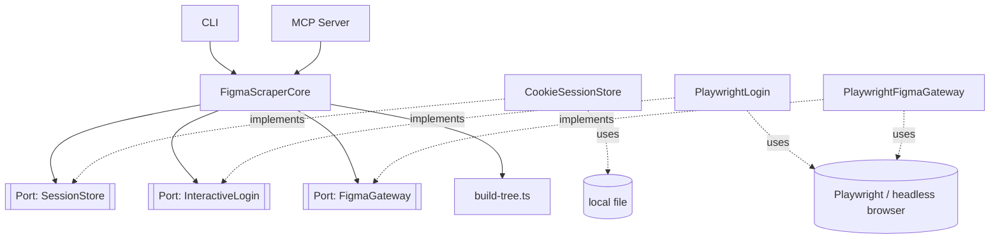

# ADR-figtools-core

## Context

We need a core that fetches Figma information (nodes and full files) without
depending on the rate limits of Figma's REST API / MCP server on free
accounts. The core must be decoupled from how data is obtained (scraping via
headless browser, today with Playwright) and from the interface that
consumes it (today a CLI and an MCP server). The acceptance criteria for
this behavior are already defined in
[`specs/manage_figma_session.spec`](../specs/manage_figma_session.spec)
and [`specs/get_figma_information.spec`](../specs/get_figma_information.spec).

## Decision

- **Stack:** TypeScript/Node.

- **Pattern — decoupling the scraping and session mechanism:** Ports &
  Adapters. The core defines three ports (`SessionStore`, `InteractiveLogin`,
  `FigmaGateway`) and never imports an adapter directly; the concrete
  implementations (`CookieSessionStore`, `PlaywrightLogin`,
  `PlaywrightFigmaGateway`) are injected via `createFigmaScraperCore(deps)`.
  Direct consequence of the constraint already agreed on in `/bdd`: the core
  must not know about Playwright or any detail of how scraping happens.

- **`PlaywrightLogin` and `PlaywrightFigmaGateway` don't share a browser:**
  each one opens its own Playwright instance when it needs one; the only
  thing that crosses between login and scraping is the `FigmaSession` value
  via `SessionStore`. It's the only design compatible with the CLI's real
  use case (login and `resolveUrl` run in separate processes, with no live
  object surviving between them), so even `resolveUrl`'s internal retry
  after an expired session doesn't share a browser context — it reopens a
  new one.

- **`FigmaSession.credential`, not `.cookies`:** the name doesn't lock in
  the concrete mechanism (today it's serialized cookies), so that volatile
  detail doesn't leak into a type shared directly by the core and the three
  ports.

- **The core always requires a session, with no anonymous mode:** Figma
  doesn't expose the Inspect panel (measurements, colors) to visitors
  without a login, not even on public files — confirmed, there's no way to
  support that case today. The first implementation of
  `PlaywrightFigmaGateway` reads that panel via the DOM, which depends on
  the session always being present. A future adapter that instead
  intercepts the network response (see `FigmaFetchResult`) is the concrete
  example of why `FigmaGateway` is a port: it could be added without
  touching the core or the other adapters.

- **Pattern — URL parsing:** none from GoF. A Figma URL can only say "there
  is a `node-id`" or "there isn't one" — it never says whether that id is a
  page or any other element, because a page is, in Figma's real data, just
  another node (`type: "CANVAS"`). That's why `FigmaGateway` doesn't
  distinguish "fetch a node" from "fetch a page": both go through
  `fetchNode`, and it's `build-tree.ts` that later decides, by looking at
  the `type` of the already-fetched node, whether to build a `FigmaNode` or
  a `FigmaPage`. Only the case with no `node-id` at all needs its own
  method (`fetchDefaultPage`), because there's no id to look up there.
  Each instance of a component is already, in Figma's real model, a
  complete and independent node (it can have its own overrides) — there's
  no repeated geometric data to deduplicate, so `build-tree.ts` has no
  dedup logic either: it only maps from the raw shape to the final shape.

- **Error model:** explicit `Result<T, E>` (no `throw`). Core functions
  that can fail return `{ ok: true, value }` or `{ ok: false, error }`,
  where `error` carries a constant code (string) and a readable message.
  Chosen over native exceptions to force CLI/MCP to handle the error in the
  return type instead of relying on `try/catch`.

- **Volatility:**
  - **Volatile:** the scraping and session mechanism (Playwright today;
    could change if Figma enables the REST API without rate limits, or if
    the scraping tool changes). Lives in the adapters layer, outside the
    core.
  - **Stable:** the data contract (node tree shape, URL validation rules).
    Lives in the core and doesn't depend on how the data is obtained.

- **Organization — domain vs. feature:** by domain. A single `figma` module
  groups session + information fetching, because they share the same
  domain and today there's only one real set of consumers (CLI and MCP,
  both thin wrappers over the same core). It isn't fragmented by feature.

- **Gateway returns raw data, not the core's final shape:** `FigmaGateway`
  exposes `RawFigmaNode` — the rich, volatile shape Figma provides.
  `build-tree.ts` selects from it the stable subset of fields the core
  exposes (`FigmaNode`/`FigmaPage`), so the core's contract doesn't depend
  on how large or changeable Figma's real data shape is. See the
  interfaces section.

- **Relationships:**
  - `DERIVES_FROM` [`specs/manage_figma_session.spec`](../specs/manage_figma_session.spec)
  - `DERIVES_FROM` [`specs/get_figma_information.spec`](../specs/get_figma_information.spec)

## Proposed folder structure

```
src/
  figma/                        # domain, stable
    core.ts                     # FigmaScraperCore: orchestrates validate → parse → session → gateway → build tree
    ports.ts                    # SessionStore, InteractiveLogin, FigmaGateway
    model.ts                    # FigmaNode, FigmaPage, styles
    errors.ts                   # Result<T,E>, FigmaScraperError, codes
    build-tree.ts               # resolve: RawFigmaNode → FigmaNode | FigmaPage
  adapters/
    cookie-session-store.ts     # implements SessionStore; no Playwright, just reads/writes a file
    playwright/                 # volatile, isolated from the core
      playwright-figma-gateway.ts  # implements FigmaGateway
      playwright-login.ts          # implements InteractiveLogin
```

This tree lives in `packages/core/src/` inside the monorepo — the published package is `@figtools/core`.

## Interfaces

### Diagram (mermaid)



### TypeScript

```typescript
export type FigmaScraperErrorCode =
  | "VALIDATION_EMPTY_URL"
  | "VALIDATION_NOT_FIGMA_URL"
  | "NOT_FOUND_OR_NO_ACCESS"
  | "AUTHENTICATION_FAILED"
  // The node exists and is accessible; the gateway confirms it but can't
  // find any readable Figma panel with the node's data, depending on the
  // session's permission on the file (see spec: "Get a specific node with
  // no data panel available").
  | "INCOMPLETE_NODE_DATA";

export interface FigmaScraperError {
  code: FigmaScraperErrorCode;
  message: string;
}

export type Result<T, E> =
  | { ok: true; value: T }
  | { ok: false; error: E };

export interface CommonStyles {
  fills?: Paint[];
  strokes?: Paint[];
  strokeWeight?: number;
  cornerRadius?: number;
  effects?: Effect[];
  opacity?: number;
  blendMode?: string;
}

export interface TypographyStyles {
  fontFamily: string;
  fontWeight: number;
  fontSize: number;
  textAlignHorizontal: string;
  textAlignVertical: string;
  letterSpacing: number;
  lineHeightPx: number;
  lineHeightPercent?: number;
  textCase?: string;
  textDecoration?: string;
}

export interface FigmaNode {
  id: string;
  name: string;
  type: string;
  position: { x: number; y: number };
  size: { width: number; height: number };
  styles: CommonStyles & { typography?: TypographyStyles };
  image: File | null;
  children: FigmaNode[];
}

export interface FigmaPage {
  id: string;
  name: string;
  nodes: FigmaNode[];
}

export type FigmaScrapeResult = FigmaNode | FigmaPage;

export interface RawFigmaNode {
  id: string;
  name: string;
  type: string;
  position: { x: number; y: number };
  size: { width: number; height: number };
  styles: CommonStyles & { typography?: TypographyStyles };
  image: File | null;
  children: RawFigmaNode[];
}

export interface FigmaSession {
  credential: string;
}

export interface SessionStore {
  getSession(): Promise<FigmaSession | null>;
  saveSession(session: FigmaSession): Promise<void>;
}

export interface InteractiveLogin {
  authenticate(): Promise<FigmaSession>;
}

// The gateway distinguishes "session expired" from "doesn't exist / no
// access": they're the same kind of HTTP failure in Figma, but the core
// needs to tell them apart to know whether to trigger a re-login on its
// own or return an error to the caller.
export type FigmaFetchResult<T> =
  | { status: "ok"; value: T }
  | { status: "not-found-or-no-access" }
  | { status: "session-expired" };

export interface FigmaGateway {
  // node-id only makes sense within a file: fileKey is also needed to be
  // able to navigate to the node's real URL.
  fetchNode(fileKey: string, nodeId: string, session: FigmaSession): Promise<FigmaFetchResult<RawFigmaNode>>;
  fetchDefaultPage(fileKey: string, session: FigmaSession): Promise<FigmaFetchResult<RawFigmaNode>>;
}

// If raw.type === "CANVAS" builds a FigmaPage (its children become the
// page's nodes); for any other type it returns a FigmaNode.
export function resolve(raw: RawFigmaNode): FigmaScrapeResult;

export interface FigmaScraperCoreDeps {
  sessionStore: SessionStore;
  interactiveLogin: InteractiveLogin;
  gateway: FigmaGateway;
}

export interface FigmaScraperCore {
  /**
   * Doesn't require reauthenticate() beforehand: if there's no saved
   * session, or if the gateway responds "session-expired", it triggers
   * the login on its own, saves the new session via sessionStore, and
   * retries this same request before returning the result (spec: "The
   * session expires during a request").
   */
  resolveUrl(url: string): Promise<Result<FigmaScrapeResult, FigmaScraperError>>;

  /**
   * Independent from resolveUrl: forces a new login even if the current
   * session is still valid (spec: "Log in again..."). Saves the
   * resulting session via sessionStore before returning it, so
   * resolveUrl uses it in later calls.
   */
  reauthenticate(): Promise<Result<FigmaSession, FigmaScraperError>>;
}

export function createFigmaScraperCore(deps: FigmaScraperCoreDeps): FigmaScraperCore;
```

### Usage example

```typescript
import {
  createFigmaScraperCore,
  PlaywrightFigmaGateway,
  PlaywrightLogin,
  CookieSessionStore,
} from "@figtools/core";

const core = createFigmaScraperCore({
  sessionStore: new CookieSessionStore(),
  interactiveLogin: new PlaywrightLogin(),
  gateway: new PlaywrightFigmaGateway(),
});

// First use, expired session, or valid session: same method in all three
// cases, resolveUrl decides on its own what to do with the session.
const result = await core.resolveUrl(
  "https://www.figma.com/file/ABC123/My-Design?node-id=1-23"
);

if (!result.ok) {
  console.error(result.error.code, result.error.message);
} else {
  const node = result.value as FigmaNode;
  console.log(node.type, node.children.length);
}

// Explicit "figtools login" command in the CLI, for example.
const reauth = await core.reauthenticate();
if (!reauth.ok) {
  console.error(reauth.error.code, reauth.error.message);
}
```

## See also

- [`specs/manage_figma_session.spec`](../specs/manage_figma_session.spec) — login, session reuse, and expiration scenarios that motivate `SessionStore` / `InteractiveLogin`.
- [`specs/get_figma_information.spec`](../specs/get_figma_information.spec) — node/file fetching scenarios that motivate `FigmaGateway` and `build-tree.ts`.
- [ADR-pending-decisions](./ADR-pending-decisions.md) — known gaps against these specs (`image` capture, tree traversal into `Instance` nodes) where the fix mechanism hasn't been decided yet.
