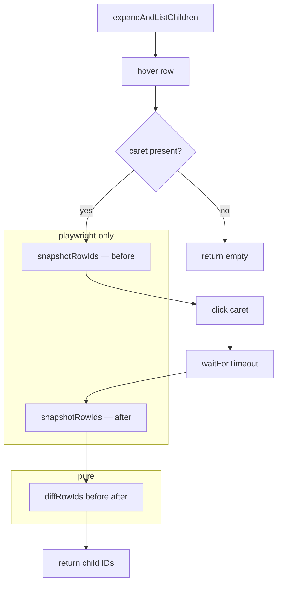

# ADR-layers-virtualization

## Context

`PlaywrightFigmaGateway.expandAndListChildren` (defined in
[`playwright-figma-gateway.ts`](../src/adapters/playwright/playwright-figma-gateway.ts))
identifies a node's direct children after expanding it in Figma's layers
panel. The layers panel is virtualized: a collapsed node's children don't
exist in the DOM until it's expanded — there's no `data-parent-id` or any
explicit hierarchy attribute in the markup.

The original approach read the indentation level (count of
`.object_row--indent--ZzXY2` elements) of every visible row after expansion
and applied the rule `indents === parentIndents + 1` to decide which rows
were direct children. This was confirmed to work for the common case
(frames, groups, text nodes) but failed when running against a real session
with Instance nodes:

- A `List Item` (Instance) at `indents=1` correctly showed its children at
  `indents=2` (`parentIndents + 1 = 2`).
- `Pikachu` (Instance, `indents=2`, nested inside `List Item`) revealed its
  child `image` at `indents=2` — the same level as itself, not at
  `parentIndents + 1 = 3`.

When the algorithm looked for Pikachu's children at `indents=3` it found
none, so Pikachu was recorded as a leaf node. The tree was silently
truncated with no error.

A second rule was proposed for the indentation approach: take whatever
`indents` the first row after the parent has as `childrenLevel`, and accept
every contiguous row at that same level. This resolves the `image` case but
introduces an unresolvable ambiguity: when `childrenLevel === parentIndents`,
a sibling of the parent that immediately follows the last child (also at
`parentIndents`) is indistinguishable from one more child, because the stop
condition (`indents < parentIndents`) never fires on a sibling at the same
level. Indentation alone can't resolve this case without a real parent-child
signal in the DOM, which Figma doesn't expose.

The root cause is that both approaches derive hierarchy from an indirect
proxy (indentation) instead of from direct evidence. Figma does give direct
evidence: the children of a node are precisely the rows that appear in the
panel after expanding that node and weren't there before. This is observable
as a set difference because the panel is virtualized — children don't exist
in the DOM until their parent is expanded.

## Decision

- **Pattern — none from GoF.** The change is a set difference on two
  snapshots of visible row IDs: rows present before expansion vs. rows
  present after. There's no hierarchy of objects, no family of related
  types to keep consistent, no behavior that varies in runtime across
  interchangeable implementations. A helper function and a pure
  transformation are sufficient.

- **Separation of pure and impure.** The transformation (`diffRowIds`) is
  separated from the DOM read (`snapshotRowIds`) so the logic can be unit
  tested without a real `Page` or a Playwright dependency:
  - `snapshotRowIds(page: Page): Promise<Set<string>>` — impure; queries
    the DOM via `page.evaluate`. Lives in `playwright-figma-gateway.ts` as
    a private method, alongside the other Playwright-specific logic.
  - `diffRowIds(before: ReadonlySet<string>, after: readonly string[]): string[]`
    — pure; takes two plain data structures and filters. Exported from its
    own file so tests can import it directly without mocking Playwright.

- **How it resolves both known problems.** Pokeball (sibling of Pikachu) is
  already visible in the panel before Pikachu is expanded. After expansion,
  the snapshot contains pokeball again but also `image` for the first time.
  The diff yields only `{image}` — pokeball's ID was in `before`, so it's
  excluded. The indentation level of either node is never read, so the
  `parentIndents + 1` assumption and the sibling-confusion ambiguity don't
  arise.

- **Volatility:**
  - **Volatile:** `snapshotRowIds` — it reads the DOM via a CSS selector
    (`[data-testid$="-layers-panel-row"]`) that Figma can change without
    notice. The existing selectors for the caret and the panel rows already
    carry this same risk, which is why they're isolated inside the
    `playwright/` adapter layer.
  - **Stable:** `diffRowIds` — a pure set-difference function with no
    dependency on Figma, Playwright, or any selector. It won't need to
    change unless the semantics of "which rows are children" change, which
    would require a change in Figma's own virtualization model.

- **Organization — new file for the pure function.** `diffRowIds` is
  exported from
  `src/adapters/playwright/layer-snapshot-diff.ts`, separate from
  `playwright-figma-gateway.ts`. It's not in `panel-readers/` because it
  doesn't read properties panel data — it reasons about which layer rows
  exist. The impure `snapshotRowIds` stays in the gateway as a private method
  because it's a Playwright detail of `expandAndListChildren`, not reusable
  outside it.

- **Relationships:**
  - `RELATED_TO` [`ADR-panel-reader-bridge`](./ADR-panel-reader-bridge.md)
    — both address volatile parts of `PlaywrightFigmaGateway`'s internal
    implementation. This document covers layer row detection;
    `ADR-panel-reader-bridge` covers properties panel reading.
  - `RELATED_TO` [`ADR-figtools-core`](./ADR-figtools-core.md) — this
    decision is internal to the Playwright adapter and doesn't change any
    port contract defined in that ADR.

## Interfaces

### Diagram (mermaid)



### TypeScript

```typescript
// src/adapters/playwright/layer-snapshot-diff.ts

// Pure: no Playwright, no DOM, no side effects.
// before: IDs visible in the layers panel before expansion.
// after: IDs visible after expansion (order is arbitrary; it's filtered, not sorted).
// Returns the IDs that appeared after expansion — those are the direct children
// of the expanded node.
export function diffRowIds(
  before: ReadonlySet<string>,
  after: readonly string[]
): string[] {
  return after.filter((id) => !before.has(id));
}
```

```typescript
// Inside PlaywrightFigmaGateway (private method, not exported)
import { diffRowIds } from "./layer-snapshot-diff";

private async snapshotRowIds(page: Page): Promise<Set<string>> {
  const ids = await page.evaluate(() => {
    const panel = document.querySelector('[data-testid="objects-panel"]');
    if (!panel) return [];
    return Array.from(panel.querySelectorAll('[data-testid$="-layers-panel-row"]'))
      .map((el) => el.getAttribute("data-testid")?.replace(/-layers-panel-row$/, "") ?? "")
      .filter(Boolean);
  });
  return new Set(ids);
}

private async expandAndListChildren(page: Page, nodeId: string): Promise<string[]> {
  const row = page.locator(SELECTORS.layerRow(nodeId));
  await row.hover();
  const caret = row.locator('[data-testid="layers-panel-expand-caret"]');
  if ((await caret.count()) === 0) return [];

  const before = await this.snapshotRowIds(page);
  await caret.click({ force: true });
  await page.waitForTimeout(300);
  const after = await this.snapshotRowIds(page);

  return diffRowIds(before, Array.from(after));
}
```

### Usage example

```typescript
// Unit test — no Playwright, no browser, no mocks needed:
import { diffRowIds } from "../layer-snapshot-diff";

const before = new Set(["frame-1", "group-2", "pokeball-3"]);
const after = ["frame-1", "group-2", "pokeball-3", "image-4"];

diffRowIds(before, after);
// → ["image-4"]

// Sibling of the parent that was already visible before expansion
// is correctly excluded because its ID is in `before`:
const withSibling = ["frame-1", "group-2", "pokeball-3", "image-4", "sibling-5"];
// sibling-5 already exists before expansion, so it would be in `before` too
const beforeWithSibling = new Set(["frame-1", "group-2", "pokeball-3", "sibling-5"]);
diffRowIds(beforeWithSibling, withSibling);
// → ["image-4"]  — sibling-5 is not a child
```

## See also

- [`ADR-panel-reader-bridge`](./ADR-panel-reader-bridge.md) — companion
  decision covering the volatile properties panel reads inside the same
  adapter.
- [`ADR-figtools-core`](./ADR-figtools-core.md) — defines the
  `PlaywrightFigmaGateway` port contract that this decision's implementation
  must continue to satisfy.
