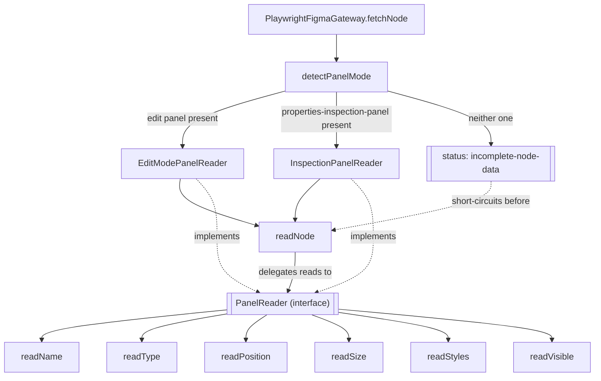

# ADR-panel-reader-bridge

## Context

`PlaywrightFigmaGateway` (defined in [`ADR-figtools-core`](./ADR-figtools-core.md))
reads a node's data by scraping the DOM of Figma's properties panel. It was
confirmed by running against real sessions that **the DOM of that panel
changes completely depending on the mode Figma renders the file in**, not
just depending on the type of node selected:

- **Edit mode** (user with editor permission): panel with editable inputs
  (`x-y-inputs-row`, `transform-width`, `consumed-style-panel` for
  fill/stroke/typography). It doesn't expose `fontFamily` or `fontWeight`
  as separate fields — clicking a typography style's name opens the
  file's style picker, not a detail of its values.
- **Inspection mode** (viewer user on a file whose organization has the
  plan that enables it): read-only panel with uniform
  `inspectionPropertyRow` pairs (`Width`, `Height`, `Font`, `Weight`,
  `Style`, `Size`, `Line height`, `Letter spacing`, `Case`, color as
  direct hex). Covers data that edit mode doesn't expose.
- **Paid Dev Mode** (`&m=dev`): on the current user's plan, entering an
  owned file with that parameter triggers an upgrade modal instead of
  showing the panel — its DOM couldn't be confirmed. Documented as an
  expected future mode, not implemented.

Which of these modes a given user sees doesn't depend only on their role on
the file: in the same session, an owned file (editor) showed the upgrade
modal when forcing `&m=dev`, while a view-only file belonging to someone
else showed the inspection panel with no upgrade prompt — it depends on the
plan of the organization that owns the file, something the gateway doesn't
control and can't reliably force via URL.

[`specs/get_figma_information.spec`](../specs/get_figma_information.spec)
already defines a third scenario, still without a real file to confirm it:
a user with view-only permission on a file whose organization doesn't
enable the inspection panel. No one knows today what Figma shows in that
case — there may be no readable panel with the node's data at all — so the
spec calls for an explicit error (`INCOMPLETE_NODE_DATA`) instead of
assuming a partial result that can't be validated.

## Decision

- **Pattern — Bridge.** The high-level abstraction (`readNode`, which
  builds a `RawFigmaNode` with the stable shape the core expects) is
  separated from the concrete implementation of how to read each field
  from the DOM (`PanelReader`, swappable depending on the detected mode).
  `readNode` doesn't change per mode; it only delegates each read
  (`readPosition`, `readSize`, `readStyles`, `readType`) to the active
  `PanelReader`. This was chosen over "one full method per mode with an
  if/switch" because that approach would duplicate the `RawFigmaNode`
  assembly logic (walking children, handling `visible`, id, name) in each
  branch, when that part is identical across modes — only how each field
  is read changes.

- **Mode detection, not forced selection.** The gateway navigates to the
  node's URL as-is (without adding `&m=dev` or any parameter), and detects
  which panel ended up present in the DOM (`properties-inspection-panel`
  exists → inspection mode; otherwise, assumes edit mode). It doesn't force
  any mode because there's no reliable way to guarantee a forced mode is
  available (see Context: the same user saw different behavior on two
  files).

- **`PanelReader` is the extension unit for future modes.** Adding paid Dev
  Mode (once its DOM can be confirmed) means adding a new
  `DevModePanelReader` and one more branch in mode detection — it doesn't
  touch `readNode` or the other `PanelReader`s.

- **`"none"` mode short-circuits before `readNode`, it never reaches a
  `PanelReader`.** When `detectPanelMode` finds neither the edit panel nor
  the inspection panel, `fetchNode` directly returns the status the core
  maps to `INCOMPLETE_NODE_DATA` (see `ADR-figtools-core`), without
  instantiating any `PanelReader` or calling `readNode`. Discarded
  alternative: a `NullPanelReader` whose methods always return empty,
  letting `readNode` run anyway — that would mean spending the full tree
  traversal (potentially several minutes on a large file, see the measured
  duration in `ADR-figtools-core`) on a result that's already known
  upfront to be an error.

- **Organization — dedicated folder.** `panel-readers/` inside
  `src/adapters/playwright/`, with one file per mode plus the shared
  interface. Cleanly separates "DOM selectors per mode" (volatile, changes
  if Figma redesigns a specific panel) from the rest of the gateway
  (`readNode`, walking children, synthesizing the CANVAS node), which
  doesn't depend on which mode is active.

- **Volatility:**
  - **Volatile:** each mode's DOM selectors — real instability has already
    been seen in edit mode (node types without full coverage, fill/stroke
    only confirmed when the node has a named style applied). Lives
    encapsulated inside each `PanelReader`.
  - **Stable:** the shape of `RawFigmaNode` and the tree traversal
    (`readNode`, `expandAndListChildren`, synthesizing the CANVAS node) —
    doesn't change across modes, already tested against real sessions.

- **`FigmaFetchResult` gains a new status.** `ADR-figtools-core` defines
  `FigmaFetchResult<T>` with `"ok" | "not-found-or-no-access" |
  "session-expired"` — none of them cover "the node exists but there's no
  readable panel". `"incomplete-node-data"` is added, which the core maps
  to the `INCOMPLETE_NODE_DATA` error code already declared in that same
  ADR. Unlike the rest of this document's decisions, this one does touch
  the `FigmaGateway` port's contract, not just `PlaywrightFigmaGateway`'s
  internal implementation.

- **Relationships:**
  - `RELATED_TO` [`ADR-figtools-core`](./ADR-figtools-core.md) —
    extends `PlaywrightFigmaGateway`'s internal implementation; adds a
    status to `FigmaFetchResult`, the only point where this document
    touches the port contract that ADR already defines.
  - `DERIVES_FROM` [`specs/get_figma_information.spec`](../specs/get_figma_information.spec)

## Interfaces

### Diagram (mermaid)



### TypeScript

```typescript
import type { Locator, Page } from "playwright";
import type { CommonStyles, TypographyStyles } from "../../../figma/model";

// Each method receives the already-selected layers panel row and/or
// properties panel; the PanelReader doesn't navigate or click, it only reads.
export interface PanelReader {
  readName(row: Locator): Promise<string>;
  readType(row: Locator): Promise<string>;
  readVisible(row: Locator): Promise<boolean>;
  readPosition(panel: Locator): Promise<{ x: number | null; y: number | null }>;
  readSize(panel: Locator): Promise<{ width: number | null; height: number | null }>;
  readStyles(panel: Locator): Promise<CommonStyles & { typography?: TypographyStyles }>;
}

// "none": neither the edit panel nor the inspection panel ended up present
// in the DOM after loading the page — there's no PanelReader for that case.
export type PanelMode = "edit" | "inspection" | "none";

// Runs once per loaded page (not per node): the mode doesn't change across
// nodes of the same file within the same session.
export function detectPanelMode(page: Page): Promise<PanelMode>;

// Never called with mode "none" — see fetchNode in the Usage example: that
// case short-circuits before needing a PanelReader.
export function createPanelReader(mode: "edit" | "inspection"): PanelReader;
```

### Usage example

```typescript
// inside PlaywrightFigmaGateway.fetchNode, once per page.goto():
async fetchNode(fileKey: string, nodeId: string, session: FigmaSession): Promise<FigmaFetchResult<RawFigmaNode>> {
  const url = `https://www.figma.com/design/${fileKey}?node-id=${nodeId.replace(":", "-")}`;
  return this.withPage(session, url, async (page) => {
    const mode = await detectPanelMode(page);
    if (mode === "none") return { status: "incomplete-node-data" };

    const reader = createPanelReader(mode);
    const node = await this.readNode(page, nodeId, reader);
    return node ? { status: "ok", value: node } : { status: "not-found-or-no-access" };
  });
}

// readNode no longer knows anything about concrete selectors:
private async readNode(page: Page, nodeId: string, reader: PanelReader): Promise<RawFigmaNode | null> {
  const row = page.locator(SELECTORS.layerRow(nodeId));
  if ((await row.count()) === 0) return null;
  await row.click();

  const panel = page.locator(SELECTORS.propertiesPanel);
  const name = await reader.readName(row);
  const type = await reader.readType(row);
  const visible = await reader.readVisible(row);
  const { x, y } = await reader.readPosition(panel);
  const { width, height } = await reader.readSize(panel);
  const styles = await reader.readStyles(panel);

  const childIds = await this.expandAndListChildren(page, nodeId);
  const children = [];
  for (const childId of childIds) {
    const child = await this.readNode(page, childId, reader);
    if (child) children.push(child);
  }

  return { id: nodeId, name, type, position: { x, y }, size: { width, height }, visible, styles, image: null, children };
}
```

## See also

- [`ADR-figtools-core`](./ADR-figtools-core.md) — defines `FigmaGateway` as a port and `PlaywrightFigmaGateway` as its concrete adapter; this document extends that adapter's internal structure.
- [`specs/get_figma_information.spec`](../specs/get_figma_information.spec) — access-level scenarios that motivate having more than one `PanelReader`.
